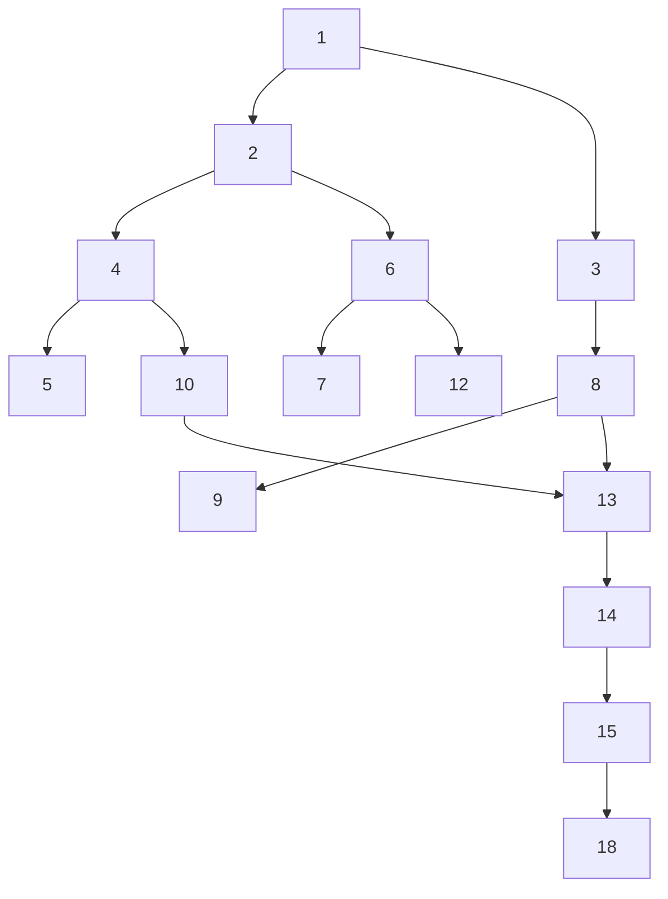

# Initial GitHub Issues for SAGE MVP

These issues should be created to kickstart the MVP development. They follow the 3-month timeline from the PRD.

## Month 1: Foundation (Weeks 1-4)

### Week 1: Basic Infrastructure
1. **[FEATURE] Set up project structure and development environment** (Priority: High)
   - Create directory structure as outlined in CLAUDE.md
   - Set up requirements.txt with core dependencies
   - Configure Streamlit settings
   - Create basic CI/CD workflow with GitHub Actions

2. **[FEATURE] Implement basic checkers game engine** (Priority: High)
   - Create board representation (8x8 grid)
   - Implement piece movement rules
   - Add capture logic
   - Create game state management

3. **[UI] Create Streamlit checkers board component** (Priority: High)
   - Visual board display
   - Click-to-move interface
   - Highlight legal moves
   - Show captured pieces

### Week 2: SAGE Coach Implementation
4. **[AGENT] Implement SAGE Coach with rule-based teaching** (Priority: High)
   - Create Coach agent with CrewAI
   - Implement basic checkers strategy knowledge
   - Add teaching method selection logic
   - Create explanation generation system

5. **[FEATURE] Implement Coach teaching styles** (Priority: Medium)
   - Demonstration mode
   - Socratic questioning
   - Error correction
   - Positive reinforcement

### Week 3: SAGE Jr Implementation
6. **[AGENT] Implement SAGE Jr learning agent** (Priority: High)
   - Create Jr agent with limited knowledge
   - Implement confidence system
   - Add learning memory
   - Create help-seeking behavior

7. **[FEATURE] Implement Jr learning progression system** (Priority: Medium)
   - Pattern recognition improvement
   - Strategic understanding metrics
   - Independence growth tracking

### Week 4: Human Interface
8. **[UI] Create human observation interface** (Priority: High)
   - Real-time Coach-Jr interaction display
   - Teaching effectiveness rating system
   - Feedback input mechanism
   - Intervention controls

9. **[FEATURE] Implement basic analytics dashboard** (Priority: Medium)
   - Session recording
   - Basic metrics visualization
   - Export functionality

## Month 2: Intelligence (Weeks 5-8)

### Weeks 5-6: Adaptation Systems
10. **[FEATURE] Implement Coach teaching adaptation** (Priority: High)
    - Human feedback processing
    - Teaching method effectiveness measurement
    - Adaptive strategy selection

11. **[RESEARCH] Create learning effectiveness metrics** (Priority: High)
    - Define measurable outcomes
    - Implement tracking systems
    - Create analysis tools

### Week 7: Enhanced Learning
12. **[FEATURE] Implement Jr advanced learning features** (Priority: Medium)
    - Pattern library building
    - Strategy comprehension
    - Mistake analysis

### Week 8: Integration
13. **[FEATURE] Implement human feedback integration loop** (Priority: High)
    - Feedback processing pipeline
    - Coach behavior modification
    - Impact measurement

## Month 3: Research & Polish (Weeks 9-12)

### Weeks 9-10: Research Tools
14. **[RESEARCH] Implement research data collection system** (Priority: High)
    - Cognitive event tracking
    - Session analytics
    - Comparative analysis tools

15. **[UI] Create research dashboard** (Priority: Medium)
    - Data visualization
    - Insight generation
    - Export capabilities

### Week 11: UX Polish
16. **[UI] Polish user interface and experience** (Priority: Medium)
    - Smooth animations
    - Improved layouts
    - Better error handling
    - Loading states

17. **[DOCS] Create user documentation** (Priority: Medium)
    - Getting started guide
    - Feature documentation
    - Research methodology guide

### Week 12: Validation
18. **[RESEARCH] Conduct validation studies** (Priority: High)
    - Pre/post assessments
    - Teaching effectiveness analysis
    - User satisfaction studies

19. **[FEATURE] Implement research export tools** (Priority: Medium)
    - Data export formats
    - Analysis notebooks
    - Report generation

## Additional Important Issues

### Testing & Quality
20. **[TEST] Set up comprehensive test suite** (Priority: High)
    - Unit tests for game logic
    - Integration tests for agents
    - E2E tests for workflows

### Performance & Deployment
21. **[FEATURE] Optimize for CPU inference** (Priority: Medium)
    - Profile performance bottlenecks
    - Implement caching
    - Optimize model loading

22. **[FEATURE] Prepare for Streamlit Cloud deployment** (Priority: Low)
    - Environment configuration
    - Resource optimization
    - Deployment documentation

## Issue Dependencies

## Suggested Labels

- `mvp` - Core MVP features
- `week-1`, `week-2`, etc. - Timeline tracking
- `blocked` - For issues with dependencies
- `good first issue` - For newcomers (e.g., documentation, simple UI)
- `research` - Research-focused tasks
- `agent` - Agent implementation
- `ui` - User interface
- `testing` - Test implementation